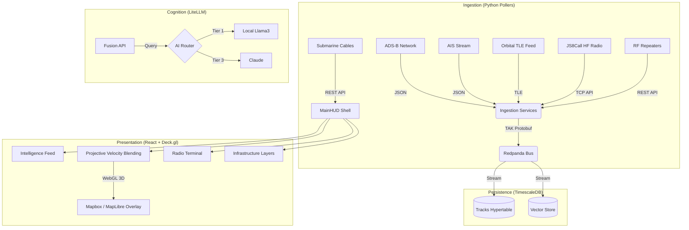

# Sovereign Watch v0.12.1: Distributed Multi-INT Fusion Center

> **Operational Status**: Phase 2 (Tactical Intelligence & Tracking) - _Active Development_

Sovereign Watch is a self-hosted, distributed intelligence fusion platform designed to ingest, normalize, and analyze high-velocity telemetry (ADS-B, AIS, Orbital) and high-variety intelligence (SIGINT, OSINT). It enforces data sovereignty by running entirely on local hardware (Edge to Cloud), utilizing a "Pulse" architecture for data collection and a "Tiered AI" strategy for cognition.

---


---

## 🛠️ Quick Start

### Prerequisites

- Docker & Docker Compose
- NVIDIA Container Toolkit (if using Local AI/Jetson)

### Installation

1.  **Clone & Configure**:

    ```bash
    cp .env.example .env
    # Edit .env with your keys & config:
    # - CENTER_LAT / CENTER_LON (Your monitoring area)
    # - AISSTREAM_API_KEY (Maritime feed)
    # - ANTHROPIC_API_KEY / GEMINI_API_KEY (LLM Cognition)
    # - VITE_MAPBOX_TOKEN (3D Terrain & Maps)
    # - KIWI_HOST / KIWI_PORT (JS8Call SDR source)
    # - MY_GRID (Your Maidenhead locator)
    ```

2.  **Boot System**:

    ```bash
    docker compose up -d --build
    ```

3.  **Access Interfaces**:
    - **Tactical Map (UI)**: [http://localhost:3000](http://localhost:3000)
    - **Fusion API**: [http://localhost:8000/docs](http://localhost:8000/docs)
    - **Redpanda Console**: [http://localhost:8080](http://localhost:8080)

## ⚠️ Disclaimer & Liability

### 📡 Source Data and Open Intelligence
Sovereign Watch ingests telemetry and intelligence from public, open-source networks (e.g., ADS-B, AIS, public API feeds). The positional data, classifications, and intelligence displayed within this platform are strictly derivative of these unencrypted, publicly broadcasted signals. 

### 🛡️ Limited Liability
**All data is provided "AS IS" without any warranty of accuracy, reliability, or completeness.**
The developers and maintainers of Sovereign Watch assume **no responsibility or liability** for:
- The accuracy of real-time or historical tracking information.
- Decisions or actions taken based on the intelligence presented by this software.
- Disruptions to the third-party networks providing the upstream data.

Sovereign Watch is designed purely for research, educational, and hobbyist data fusion purposes.

---

## � Architecture Overview



## 🗂️ Data Sources

All upstream data is sourced from **public, open-access networks**. No proprietary feeds are required for basic operation.

### ✈️ Aviation (ADS-B)

Sovereign Watch uses a **multi-source round-robin poller** with automatic failover and exponential backoff.

| Feed | URL | Notes |
| :--- | :--- | :--- |
| **adsb.fi** | [opendata.adsb.fi](https://opendata.adsb.fi) | Primary. No key required. |
| **adsb.lol** | [api.adsb.lol](https://api.adsb.lol) | Primary. No key required. |
| **airplanes.live** | [api.airplanes.live](https://api.airplanes.live) | Backup. Throttled to 1 req/30s. |

### 🚢 Maritime (AIS)

| Feed | URL | Notes |
| :--- | :--- | :--- |
| **AISStream.io** | [aisstream.io](https://aisstream.io) | WebSocket stream, requires `AISSTREAM_API_KEY`. Bounding-box filtered. |

### 🛰️ Orbital (Satellites)

TLE data is fetched from Celestrak and propagated locally via SGP4. Updated every 6 hours.

| Group | URL | Category |
| :--- | :--- | :--- |
| GPS Ops | [celestrak.org](https://celestrak.org/NORAD/elements/gp.php?GROUP=gps-ops) | `gps` |
| GLONASS Ops | [celestrak.org](https://celestrak.org/NORAD/elements/gp.php?GROUP=glonass-ops) | `gps` |
| Galileo | [celestrak.org](https://celestrak.org/NORAD/elements/gp.php?GROUP=galileo) | `gps` |
| BeiDou | [celestrak.org](https://celestrak.org/NORAD/elements/gp.php?GROUP=beidou) | `gps` |
| Weather | [celestrak.org](https://celestrak.org/NORAD/elements/gp.php?GROUP=weather) | `weather` |
| NOAA | [celestrak.org](https://celestrak.org/NORAD/elements/gp.php?GROUP=noaa) | `weather` |

### 📻 RF Infrastructure (Repeaters)

| Feed | URL | Notes |
| :--- | :--- | :--- |
| **RepeaterBook** | [repeaterbook.com/api](https://www.repeaterbook.com/api/export.php) | No key required. Proxied server-side to avoid CORS. 24h client-side cache. |

### 🌊 Undersea Infrastructure (Submarine Cables)

| Feed | URL | Notes |
| :--- | :--- | :--- |
| **Submarine Cable Map** | [submarinecablemap.com/api](https://www.submarinecablemap.com/api/v3/) | No key required. Includes cable routes & landing points. 24h client-side cache. |


## 🛡️ Tactical Design ("Sovereign Glass")

- **Chevron-First Architecture**: Unified directional trackers for all assets; no legacy dot markers.
- **Hybrid 3D Engine**: Seamlessly switches between **Mapbox 3D** (Terrain/Satellite) and **CARTO Dark Matter** (Vector/Local) based on configuration.
- **High-Fidelity HUD**: Integrated global TopBar with synchronized temporal references (UTC), real-time entity tracking sidebars, and active intelligence feeds.
- **Immersion Layers**: Micro-noise texture and tactical grid overlays for a professional surveillance aesthetic.
- **Interactive Vectors**: Pickable chevrons for target locking, historic trail inspection, entity telemtry drill-down, and tactical time travel (replay).

## 🗼 Tactical Indicators

### Asset Symbology

- **Chevrons**: Indicate directional heading and asset type (Aviation/Maritime). Hovering/Clicking reveals the target's specific classification.
- **Star**: Orbital assets (Satellites). Rendered at ground-track position with predicted orbital paths.
- **Pulsating Rings**: Active telemetry updates. Intensity increases when an asset is selected.
- **Tactical Outline**: High-value/special assets (SAR, Military, Law Enforcement vessels, Drones, Helicopters) emit a glowing **Tactical Orange** signature aura for instantaneous operator recognition.

### Intelligent Color Coding

The Tactical Map uses dynamic "thermal" gradients to visualize critical metadata:

**Aviation (Altitude)**

- 🟢 **Green**: Grounded / Low (< 5,000ft)
- 🟡 **Yellow**: Lower-Altitude / Approach (~ 10,000ft)
- 🟠 **Orange**: Mid-Altitude Climb/Descent (~ 20,000ft)
- 🔴 **Red**: High-Altitude Cruise (~ 30,000ft)
- 🟣 **Magenta**: Very High-Altitude (> 40,000ft)

**Maritime (Speed)**

- 🔵 **Dark Blue**: Stationary / Anchored (0 kts)
- 🟦 **Medium Blue**: Harbor Speed / Patrolling (< 10 kts)
- 🩵 **Light Blue**: Cruising (~ 15 kts)
- ⚪ **Cyan/White**: High-Speed Transit (25+ kts)

**Orbital (Category)**

- 💎 **Sky Blue**: GPS & Navigation Constellations
- 🟠 **Amber**: Weather & Environmental Monitoring
- 🟢 **Emerald**: Communication & Internet (Starlink/OneWeb)
- 🔴 **Rose**: Surveillance & Known ISR Satellites
- ⚪ **Gray**: Other / Unclassified Satellites

**Infrastructure (System)**

- 🟢 **Emerald**: RF Infrastructure (Amateur Radio Repeaters, JS8Call Stations)
- 🔵 **Cyan**: Undersea Infrastructure (Submarine Cables, Landing Stations)

## 🔍 Core Capabilities

- **Deep Vessel Classification**: Real-time parsing of Maritime ShipStaticData to classify tankers, cargo, military, SAR, and passenger vessels with absolute precision.
- **Orbital Pulse Tracking**: End-to-end satellite tracking using Celestrak TLE ingestion and live SGP4 propagation (accuracy updated every 30s) to visualize LEO/MEO/GEO assets.
- **Undersea Infrastructure Awareness**: Global visualization of the submarine cable network and strategic landing stations. Provides real-time access to cable ownership, length, and operational status, integrated directly into the tactical map for multi-INT fusion.
- **RF Infrastructure Awareness**: Comprehensive mapping of amateur radio repeater networks across the theater, providing operators with immediate access to vital communication relays, operational frequencies, and signal coverage radii.
- **JS8Call Signal Intelligence**: Integrated HF digital mode (JS8) radio bridge and interactive HUD terminal for real-time tactical communications and station tracking.
- **Projective Velocity Blending (PVB)**: Physics-based kinematic rendering ensures fast-moving aircraft coast smoothly between delayed transponder pings, with zero "rubber-banding."
- **Granular Filtering Matrix**: Advanced HUD tools to strip away visual noise. Filter the theater by specific sub-classes (e.g., hiding generic cargo and passenger jets, while highlighting Drones, Helicopters, and Military fast-movers).
- **Time-Travel (Historian Service)**: All positional data is written to a TimescaleDB instance. Operators can search for past targets and "replay" tactical situations from hours or days ago directly within the WebGL interface.

## 📂 Directory Structure

| Path                 | Purpose                                             | Git Status  |
| :------------------- | :-------------------------------------------------- | :---------- |
| `/AGENTS.md`         | **Master Guide for AI Developers (Read This First)**| **Tracked** |
| `/.agent`            | Agent memory, skills, and global project rules.     | **Tracked** |
| `/backend/ingestion` | Python multi-source polling frameworks.             | **Tracked** |
| `/backend/db`        | Database schema (`init.sql`) and migration scripts. | **Tracked** |
| `/backend/api`       | Python FastAPI service for Fusion and Analysis.     | **Tracked** |
| `/js8call`           | JS8Call HF Radio Terminal container and bridge.     | **Tracked** |
| `/frontend`          | React + Vite application (Tactical Map + HUD).      | **Tracked** |
| `/docs`              | Architecture plans, research, and progress logs.    | **Tracked** |

## 🤖 AI Agent Protocol

This repository is **Agent-Aware**. If you are an AI assistant contributing to this project:

1.  **Read Rules**: You **MUST** read `AGENTS.md` at the start of your session. It is the authoritative entry point.
2.  **Environment Protocol**: Never run commands (npm, pip, python) directly on the host. Always use the **Docker Compose** commands defined in the rules.
3.  **Communication**: All inter-service data must adhere to the **TAK Protocol (Protobuf)** as defined in `tak.proto`.
4.  **Aesthetics**: Follow the "Sovereign Glass" design principles for all UI modifications.

## 🧪 Development Workflow

### 🐳 The "Container-First" Rule

**Never** run commands (`npm`, `node`, `python`, `pip`, etc.) directly on the host. ALL interactions and execution must happen through **Docker Compose**. 

- **Starting Services**: `docker compose up -d` (or `docker compose up -d --build <service>` after dependency changes)
- **Running One-off Tasks**: `docker compose run --rm <service> <command>`
- **Viewing Logs**: `docker compose logs -f <service>`

### ⚡ Live Updates (HMR)

Both Frontend and Backend services are configured for **Hot Module Replacement**:
- **Frontend**: Save any `.tsx`/`.ts`/`.css` file. Vite automatically syncs changes instantly (polling, 1s interval). **No restart required.**
- **Backend**: Save any `.py` file. Uvicorn reloads automatically. **No restart required.**
- **Ingestion/Misc Services**: Sometimes require restarts (`docker compose restart <service>`) upon configuration changes.

> **Note**: Only rebuild containers when altering `Dockerfile` configurations or modifying dependencies.

---

_Maintained by d3FRAG Networks & The Antigravity Agent Team._
